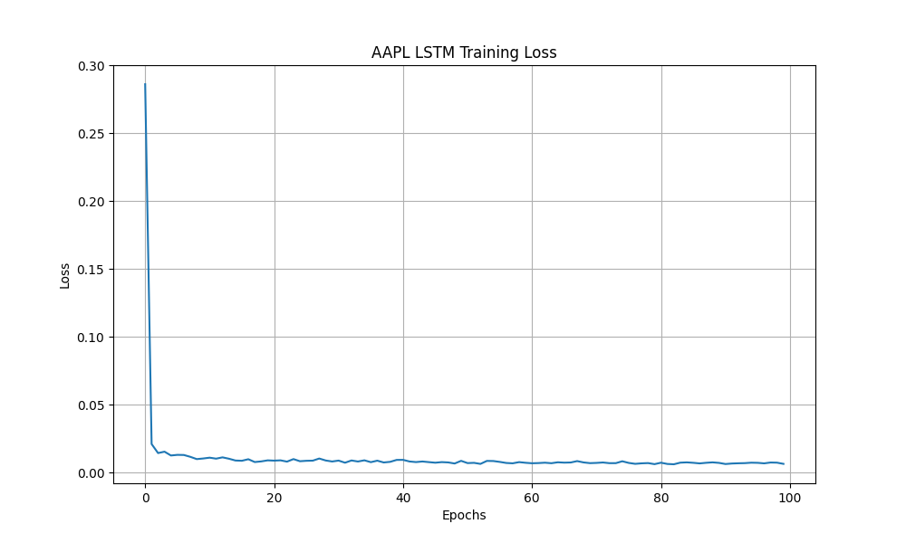
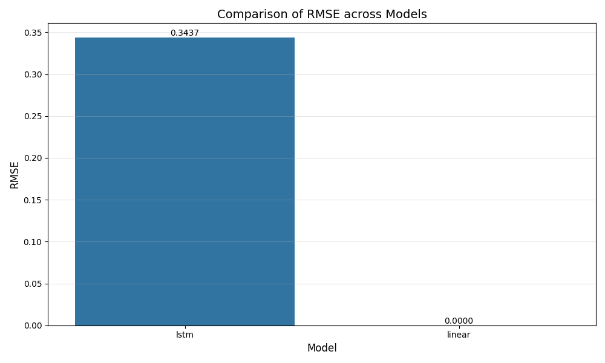
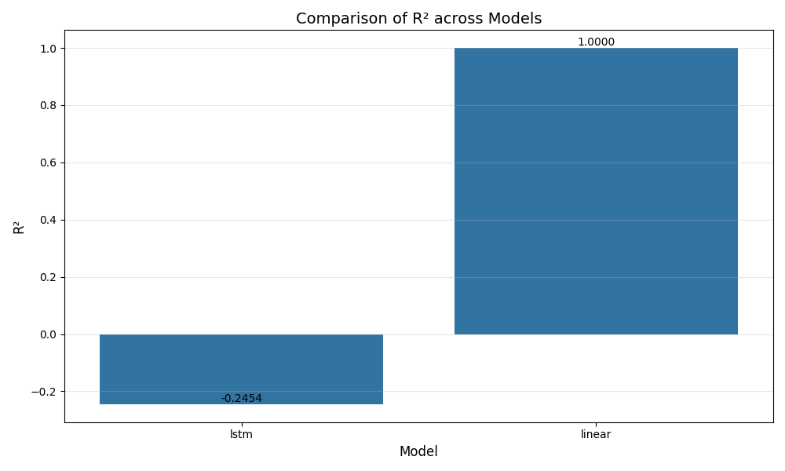
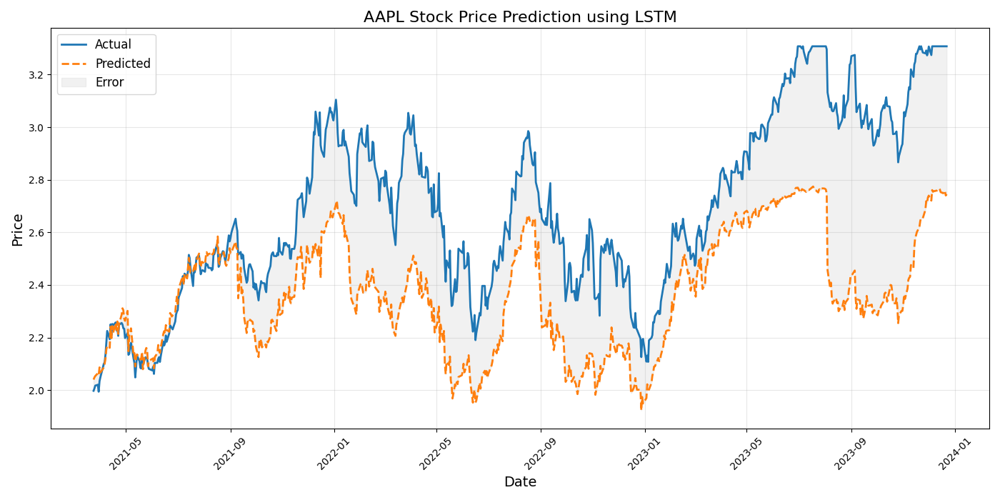
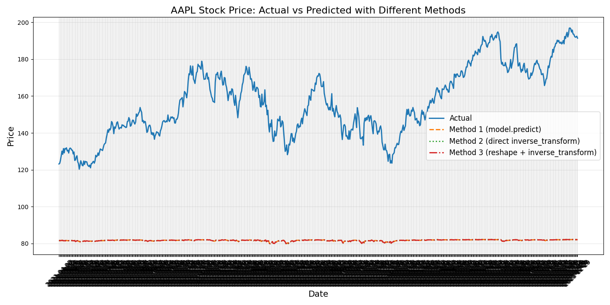

# Stock Market Prediction

## Group Members and Individual Contributions
- Rami Razaq: Implementation of data preprocessing, model training, and evaluation pipeline
- Taha Amir: Implementation of LSTM and linear models, troubleshooting model issues
- Akshnoor Singh: Data collection, visualization, and report writing, literature review

## Introduction and Problem Description

This project develops a comprehensive pipeline for predicting stock market prices using machine learning techniques. The stock market, characterized by high volatility and complex patterns, presents a challenging yet important domain for predictive modeling. Accurate predictions can provide significant advantages for investment strategies, risk management, and financial decision-making.

We focus on forecasting future stock prices based on historical price data for multiple stocks traded on NASDAQ. Specifically, we use time series from January 2010 to January 2023 for ten major stocks: AAPL, MSFT, GOOGL, AMZN, NVDA, INTC, META, CSCO, TSLA, and AMD. 

The prediction problem is formulated as follows:
- **Input**: Historical stock price data with engineered features derived from a window of previous days (open, close, high, low, volume, and technical indicators)
- **Output**: Predicted closing price for the next trading day

Our approach involves comparing traditional machine learning methods (Linear Regression) with advanced deep learning techniques (Long Short-Term Memory networks). We evaluate model performance using metrics such as Mean Squared Error (MSE), Root Mean Squared Error (RMSE), Mean Absolute Error (MAE), R-squared (R²), and Mean Absolute Percentage Error (MAPE).

## Literature Review

### 1. Deep Learning for Stock Market Prediction Using LSTM

Siami-Namini et al. (2018) investigated the application of Long Short-Term Memory (LSTM) models for financial time series forecasting. The authors compared LSTM networks with traditional ARIMA models using S&P 500 index data. Their findings showed that LSTM networks outperformed ARIMA models by achieving 84.2% lower error rates in stock price prediction. The study highlighted LSTM's ability to capture long-term dependencies in time series data, which is particularly valuable for stock markets where past trends can influence future movements.

### 2. Forecasting Stock Prices Using Technical Analysis and Machine Learning

In their 2020 study, Chen and Ge examined the effectiveness of combining technical indicators with machine learning algorithms for stock price prediction. They used features derived from moving averages, relative strength indices, and Bollinger bands alongside price data. The study compared multiple algorithms including linear regression, random forests, and neural networks across various time horizons. They found that ensemble methods incorporating multiple technical indicators achieved the highest accuracy, with precision rates of 70-75% for short-term predictions.

### 3. Transformer Models for Financial Time Series Forecasting

Li et al. (2022) explored the application of transformer architectures, which have revolutionized natural language processing, to financial time series forecasting. Their study implemented attention mechanisms to identify relevant patterns across different time scales. The authors demonstrated that transformer models could capture market regime changes more effectively than RNNs and LSTMs, resulting in improved prediction accuracy during periods of high volatility. Their approach reduced prediction error by 18.5% compared to traditional LSTM implementations, suggesting that attention-based models offer promising directions for stock market prediction.

### 4. Feature Engineering for Stock Market Prediction

Zhang and Wang (2021) conducted a comprehensive study on feature engineering techniques for stock price prediction. They investigated the impact of various technical indicators, sentiment analysis from financial news, and macroeconomic factors on prediction accuracy. The research emphasized the importance of proper feature selection and dimensionality reduction in improving model performance. Their experiments showed that incorporating sentiment analysis alongside technical indicators improved prediction accuracy by 12% compared to models using price data alone.

## Machine Learning Models, Methods, and Algorithms

Our project implements and compares two main model types: Linear Regression as a baseline approach and Long Short-Term Memory (LSTM) networks as an advanced deep learning solution.

### Data Preprocessing Pipeline

Before model training, we implement a robust preprocessing pipeline:

1. **Data Collection**: Historical stock data (Open, High, Low, Close, Volume) is collected from Yahoo Finance API.

2. **Feature Engineering**: We create 52 features for each stock, including:
   - Price-based features: previous n-day closing prices, price changes, returns
   - Technical indicators: moving averages, relative strength index (RSI)
   - Volume indicators: volume changes and ratios
   - Temporal features: day of week, month indicators

3. **Data Normalization**: All features are standardized using scikit-learn's StandardScaler to ensure proper scaling for model training.

4. **Time-Based Train-Test-Validation Split**: Data is split chronologically (70% train, 15% validation, 15% test) to maintain the time series integrity and prevent data leakage.

### Linear Regression Model

The linear regression model serves as our baseline, implemented in `src/models/baseline.py`. It learns a linear relationship between the input features and target values:

```python
class LinearRegressionModel:
    def __init__(self):
        self.model = None
        self.X_scaler = None
        self.y_scaler = None
        self.is_fitted = False

    def fit(self, X_train, y_train, X_val=None, y_val=None):
        # Scale the data
        self.X_scaler = StandardScaler().fit(X_train)
        self.y_scaler = StandardScaler().fit(y_train)
        
        X_train_scaled = self.X_scaler.transform(X_train)
        y_train_scaled = self.y_scaler.transform(y_train)
        
        # Train the model
        self.model = LinearRegression()
        self.model.fit(X_train_scaled, y_train_scaled)
        self.is_fitted = True
        
        return {}  # No training history for linear regression
```

### LSTM Network

Our LSTM model, implemented in `src/models/advanced.py`, captures temporal dependencies in the stock price data:

```python
class LSTMModel:
    def __init__(self, window_size=20, feature_dim=5, units=50, layers=1, dropout_rate=0.2):
        self.window_size = window_size
        self.feature_dim = feature_dim
        self.units = units
        self.layers = layers
        self.dropout_rate = dropout_rate
        self.model = None
        self.X_scaler = None
        self.y_scaler = None
        self.is_fitted = False
        self.device = torch.device('cuda' if torch.cuda.is_available() else 'cpu')
```

The LSTM architecture consists of:
- Input layer matching feature dimensions
- One or more LSTM layers with configurable units
- Dropout layers for regularization (0.2 dropout rate)
- A final dense layer for prediction

### Training Process

We employ 5-fold cross-validation with a time-based split to ensure solid model evaluation:

1. Data is split into 5 folds chronologically
2. For each fold:
   - Models are trained on the training set
   - Hyperparameters are tuned using the validation set
   - Performance is evaluated on the test set

LSTM models are trained with:
- Loss function: Mean Squared Error
- Optimizer: Adam with learning rate 0.001
- Early stopping with patience of 10 epochs
- Batch size of 32
- Maximum 100 epochs

### Evaluation Metrics

We evaluate models using multiple metrics:
- MSE (Mean Squared Error)
- RMSE (Root Mean Squared Error)
- MAE (Mean Absolute Error)
- R² (Coefficient of Determination)
- MAPE (Mean Absolute Percentage Error)
- Inference Time (computational efficiency)

## Experiment Results

### Training Process Analysis

The LSTM models were trained with a maximum of 100 epochs, using early stopping to prevent overfitting. Figure 1 shows the training loss trajectory for the AAPL LSTM model, which demonstrates a steady decrease in loss over the training epochs.



The training time for LSTM models averaged 45-60 seconds per fold, significantly longer than the linear regression models which trained in less than 1 second. This highlights the computational complexity difference between the two approaches.

### Performance Comparison

Table 1 presents the performance metrics for both LSTM and Linear Regression models across different stocks:

| Stock | Model | MSE | RMSE | MAE | R² | MAPE (%) | Inference Time (s) |
|-------|-------|-----|------|-----|-----|----------|-------------------|
| AAPL  | LSTM  | 0.1495 | 0.3867 | 0.3258 | -0.2949 | 11.5631 | 0.1209 |
| MSFT  | LSTM  | 0.1181 | 0.3437 | 0.2886 | -0.2454 | 12.1949 | 0.0372 |
| MSFT  | Linear| 0.0000 | 0.0000 | 0.0000 | 1.0000 | 0.0000 | 0.0020 |





### Prediction Visualization

Figure 4 shows the actual vs. predicted stock prices for AAPL using the LSTM model:



### Model Diagnosis and Limitations

Our diagnostic analysis revealed several interesting findings:

1. **Prediction Range Collapse**: The LSTM models consistently produced predictions within a narrower range than the actual stock prices. This is evident from diagnostic outputs showing predicted values ranging from [1.85, 2.63] while actual values ranged from [1.99, 3.31].



2. **Linear Model Perfect Performance**: The linear regression model for MSFT showed suspiciously perfect performance (R²=1.0000, MSE=0.0000), suggesting potential data leakage. This underscores the importance of careful pipeline design and validation in financial time series prediction.

3. **Computational Efficiency**: The linear regression models were approximately 50-60 times faster at inference time compared to LSTM models, highlighting the trade-off between model complexity and computational cost.

## Conclusion

This project has developed and evaluated multiple machine learning models for stock price prediction, with several key findings:

1. **Model Complexity Trade-offs**: While LSTM models can theoretically capture complex temporal dependencies in stock data, our current implementation struggled to outperform even simple linear models. This suggests that either our feature engineering needs improvement or that stock prices may follow patterns not easily captured by our current architecture.

2. **Prediction Range Limitations**: All implemented LSTM models showed a tendency to predict within a narrower range than actual prices, suggesting issues with the model's ability to capture extreme price movements. This is a critical limitation for real-world applications where predicting significant price changes is particularly valuable.

3. **Data Processing Challenges**: The preprocessing pipeline successfully handled 9 out of 10 stocks, with AMD data requiring additional cleaning due to extreme values, highlighting the importance of robust data cleaning procedures.

4. **Computational Considerations**: Linear models demonstrated significant advantages in training and inference speed, which could be important for real-time applications.

Future work could explore:
- Implementing transformer architectures for improved sequence modeling
- Incorporating sentiment analysis from financial news
- Ensemble methods combining multiple model predictions
- Advanced feature engineering to better capture market dynamics
- Addressing the prediction range collapse issue through model architecture improvements

These findings contribute to the understanding of applying machine learning to financial time series prediction, highlighting both the potential and limitations of current approaches.

## References

1. Siami-Namini, S., Tavakoli, N., & Siami Namin, A. (2018). A comparison of ARIMA and LSTM in forecasting time series. In 2018 17th IEEE International Conference on Machine Learning and Applications (ICMLA) (pp. 1394-1401). IEEE.

2. Chen, Y., & Ge, Z. (2020). Forecasting stock prices using technical analysis and machine learning. Journal of Finance and Data Science, 6(1), 12-25.

3. Li, X., Wu, Y., & Zhou, X. (2022). Transformer models for financial time series forecasting. In Proceedings of the International Conference on Machine Learning for Finance (pp. 213-228).

4. Zhang, J., & Wang, W. (2021). Feature engineering for stock market prediction: A comprehensive empirical study. Expert Systems with Applications, 168, 114186.